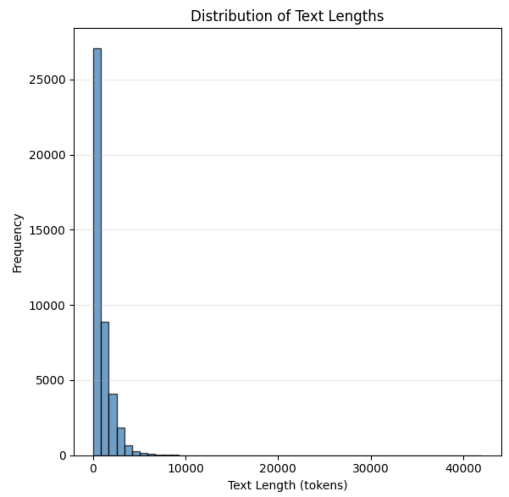

### Summarization Setup

The length of the input text is a classic problem in summarization tasks. The length of the input text for summarization may exceed the model's context window or GPU RAM limitations when using transformer architecture.
For self-attention, memory scales quadratically with sequence length.
The simplest solution is to truncate input id sequence according to maximum allowed length.
The maximum allowed length can be increased in proportion to batch size and float precision scaling.

`gemma3-1b` can process [up to 32k tokens](https://ai.google.dev/gemma/docs/core#128k-context).

Input text from dataset `csebuetnlp/xlsum` ranges from 26 to 41994 tokens, but the mean is only 969 tokens, with most entries not exceeding 5000 tokens:

This statistic informs the optimum maximum token length relative to GPU resources.

Often, the main point of an article is expressed in the beginning of the text, particularly in language styles like news articles. So it is possible that truncating input text for summarization has minimal effect on summarization quality.

Other possible methods include hierarchical summarization (chunking the input text), extracting the most relevant parts of the text fist (through extractive summarization or ranking), or using transformers for long sequences like Longformer.

### Custom Summarization Metrics
I have implemented additional evaluation metrics ROUGE, BLEU, and BERTScore, but others like METEOR, Topic Similarity (TS), and AlignScore [have also been used](https://arxiv.org/pdf/2503.10676v1).

Combining custom metrics with trl's SFTTrainer proved to be challenging due lack of support: https://github.com/huggingface/trl/issues/1222.
Additionally, these custom metrics require decoded text as input, which needs a `.generate` call that is separate from the basic `forward` pass called inside Trainer's `.evaluate` function which is used to calculate evaluation loss.
My solution was to replace the `.evaluate` method with a custom method which additionally creates a smaller evaluation subset and calls `.generate` in order to get predicted text which is then passed onto the custom metrics.
This seems to have been done before: [https://github.com/huggingface/transformers/issues/26474](https://github.com/huggingface/transformers/issues/26474).

One thing my implementation lacks is a progress bar, but this proved to be too time-consuming to implement since it would require meddling with a method below `.evaluate`.

### SFT Model Selection
During best model selection, I am ignoring validation loss and using ROUGE_L alone as it is informative enough and the two metrics should be mostly correlated.
As per the technical description, best model selection happens programmatically.
I would not recommend selecting the best model blindly like that in practice.
I would recommend manually inspecting model outputs and metric graphs before moving onto alignment.

### Alignment
A major issue with aligning the fine-tuned model is a lack of a dataset with long toxic texts which we can prompt the model to summarize.

I re-use the summarization dataset to prompt the model to summarize Ukrainian texts.
However, it is unlikely that the `csebuetnlp/xlsum` dataset consists any toxic articles in the first place.
Additionally, `gemma3-b1` is already aligned against toxic language during instruction tuning.
So prompting this model with this dataset is unlikely to result in any toxic examples.
Reusing the `ukr-detect/ukr-toxicity-dataset` dataset which was used to train the classifiers is not the best approach either since it seems to be compiled of social media posts and messages and does not contain long sequences.

Even an unlabelled collection of longer toxic texts will have a measurable effect of GRPO results.

In order to compile a toxic summarization dataset:
- Use a larger unaligned LLM to prompt to generate explicitly toxic Ukrainian texts
- Prompt an unaligned LLM to generate long texts with examples from the `ukr-detect/ukr-toxicity-dataset` dataset
- Use Ukrainian literature which contains toxic language, such as from the post-modern, urbanistic, informal genre. I implemented a small example of this to periodically sanity check GRPO training by extracting text from Les Podervianskyi's plays.

Since compiling such dataset is outside the scope of this project, I resorted to using GRPO as the alignment method since it can use reward functions directly and has been shown to perform better than DPO.
For reward functions, I use both classifiers and return the difference between the class probabilities as the scalar reward. `GRPOTrainer` assigns reward weights to the two functions by default.

### Hydra Issues
I insisted on declaring configs within python dataclasses because this allows to declare more advanced data types, as well as typing and validation.
I also decided to keep each config consistent with trl config classes, so that I can simply call `instantiate` in order to convert a hydra config to a trl config with a single line.
Then I had the idea of separating smaller config groups, like optimizer configs, and then folding/merging them into main training configs, which is consistent with hydra design.

However, this seems to not work when the configs are declared in py dataclasses instead of yaml files. I am still not sure if this is intended or a bug.
I had to stop the investigation since it was becoming too time-consuming.
I resolved this by creating a separate dataclass which inherits both main training config and optimizer, and the parameters are replaced (see `config/optimizer.py`).
I don't think this is the most elegant solution, but it works as intended and allows me to keep configs as dataclasses.

The other solution would be to re-write all configs into yaml format and forego typing and validation.

### Out of Scope
- Advanced summarization data setup
- Model testing
- Manual model checking and selection
- Alignment dataset development
- Hyperparameter optimization (most time and resource consuming)
- Ablation experiments (this setup has two adapters, would training one adapter on both tasks impact performance significantly?)
- More detailed logging / commenting
- Advanced cosmetic touches to python code (such as sorting imports)
